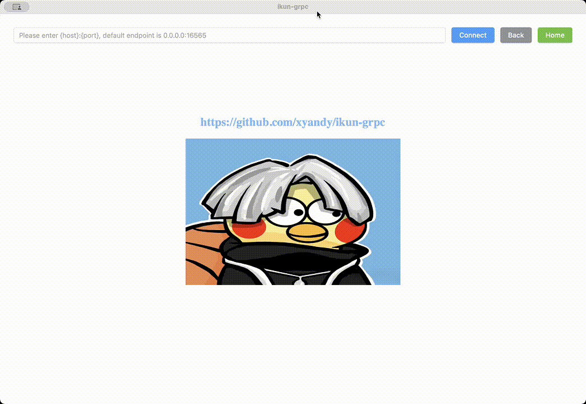

# Ikun-grpc

`Ikun-grpc` is a cross platform grpc client based on grpc reflection. It's sort of like Postman which can help you interact with grpc servers

## Features

- Runs on Windows, Mac and Linux **(done)**
- Selection of multiple grpc services and methods **(done)**
- Automatically render grpc request json template based on protobuf definition **(done)**
- Invoke grpc API with grpc metadata support **(done)**
- Show grpc request and response protobuf definition **(done)**
- TLS support (Now only support plaintext) **(todo)**
- `.proto` file discovery (Now only support grpc reflection) **(todo)**

## Usage

## Download

## Development

It is a wails project and tech stack is **wails (golang) + vue3 (js)**.

To run in live development mode, run `wails dev` in the project directory. This will run a Vite development
server that will provide very fast hot reload of your frontend changes. If you want to develop in a browser
and have access to your Go methods, there is also a dev server that runs on http://localhost:34115.
